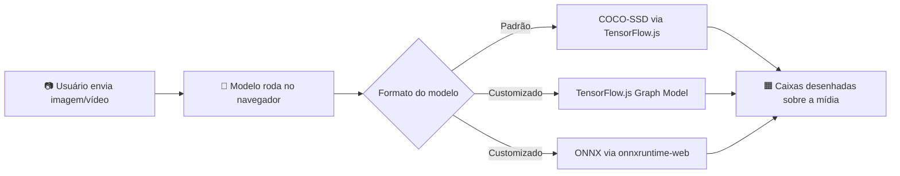

# 🎯 Detector Universal de Objetos

> Detecção de objetos em imagens e vídeos, rodando **inteiramente no navegador** — sem backend, sem servidor, sem custo de infraestrutura. Construído para rodar dentro de um app [Lovable](https://lovable.dev).

---

## ✨ Visão geral

Este projeto é um detector de objetos "universal": ele vem com um modelo pronto para uso (treinado no dataset **COCO**, ~90 classes comuns — pessoas, carros, animais, eletrônicos, etc.), mas permite trocar esse modelo por qualquer outro, em dois formatos diferentes.

Tudo roda no navegador do usuário via **TensorFlow.js** e **ONNX Runtime Web**. Não existe nenhum servidor Python, nenhuma API externa, nenhum upload de imagem para a nuvem — a inferência acontece localmente, usando a GPU do próprio dispositivo (via WebGL/WASM).



---

## 🚀 Principais recursos

| Recurso | Descrição |
|---|---|
| **Modelo padrão pronto** | COCO-SSD (base `mobilenet_v2`), sem nenhuma configuração necessária |
| **3 níveis de qualidade** | Rápido / Equilibrado / Máxima precisão — ajustam modelo, resolução e frequência de detecção juntos |
| **Troca de modelo** | Aceita modelos customizados em **TensorFlow.js** ou **ONNX** |
| **Imagem e vídeo** | Detecta em fotos estáticas ou frame a frame em vídeos enviados |
| **Confiança em tempo real** | O slider de confiança refiltra e redesenha instantaneamente, sem rodar o modelo de novo |
| **Suavização temporal** | Em vídeo, reduz flicker e falsos positivos passageiros com rastreamento entre ciclos |
| **100% client-side** | Nenhum dado sai do navegador do usuário |

---

## 📁 Estrutura dos arquivos

```
src/
├── lib/
│   ├── objectDetector.ts   # Lógica de detecção (TF.js + ONNX Runtime Web)
│   └── tracker.ts          # Suavização temporal para vídeo
└── components/
    └── DetectorApp.tsx     # Interface completa (upload, slider, painel de modelo)
```

---

## 🎚️ Como funciona a troca de modelo

Se o usuário **não mexer em nada**, o app usa o modelo padrão (COCO-SSD, nível "Equilibrado"). A troca é opcional e tem três caminhos:

### 1. Níveis de qualidade (built-in)
| Nível | Modelo base | Resolução de detecção | Intervalo (vídeo) |
|---|---|---|---|
| Rápido | `lite_mobilenet_v2` | até 480px | 400ms |
| **Equilibrado** (padrão) | `mobilenet_v2` | até 800px | 350ms |
| Máxima precisão | `mobilenet_v2` | até 1280px | 600ms |

### 2. Modelo customizado em TensorFlow.js
Uma URL apontando para um `model.json` (Graph Model) + seus arquivos `.bin`.

> ⚠️ **Atenção**: desde o final de 2025, o próprio `tfhub.dev` passou a **bloquear (HTTP 403)** o carregamento direto de modelos pelo navegador. Se o modelo vier do TensorFlow Hub, é necessário baixar os arquivos e hospedá-los em outro lugar que você controle (GitHub Pages, Google Cloud Storage, Vercel, etc.) antes de usar a URL aqui.

### 3. Modelo customizado em ONNX
Uma URL apontando para um arquivo `.onnx`, hospedado com CORS habilitado.

---

## ⚠️ Limitação: o código não suporta qualquer modelo ONNX

O carregamento do arquivo `.onnx` funciona para qualquer modelo. A **interpretação do resultado** (`detectOnnx()`, em `objectDetector.ts`), porém, só está implementada para um formato de saída específico.

**Funciona sem problema:**
- Modelos **YOLOv8** e **YOLOv11** (Ultralytics) — saída única `[1, 4+classes, caixas]`, coordenadas centralizadas (cx, cy, w, h).

**Não funciona (saída interpretada incorretamente — caixas erradas, classes trocadas ou nenhuma detecção):**
- **YOLOv5** — saída `[1, caixas, 5+classes]`, com valor de "objectness" separado.
- **SSD / Faster R-CNN** (padrão TF Object Detection API) — quatro saídas separadas (`detection_boxes`, `detection_classes`, `detection_scores`, `num_detections`).
- **DETR / RT-DETR** — formato de saída baseado em Transformers, diferente dos anteriores.
- Qualquer outra arquitetura com formato de saída distinto do YOLOv8/v11.

Para suportar um desses formatos, é necessário reescrever a etapa de leitura da saída em `detectOnnx()` — a etapa de pré-processamento da imagem de entrada não muda.

---

## 🎯 Confiança em tempo real — como funciona por baixo dos panos

A detecção roda com um "piso" técnico de confiança bem baixo (5%), retornando **todas** as caixas encontradas acima desse piso. O slider de confiança da interface não dispara uma nova inferência — ele apenas filtra, em JavaScript puro, quais dessas caixas já calculadas devem aparecer na tela. Por isso:

- **Em imagens**: a resposta ao slider é instantânea.
- **Em vídeo**: cada ciclo de detecção (a cada 300–600ms, dependendo da qualidade escolhida) sempre usa o valor mais recente do slider — a resposta é quase instantânea, limitada apenas pelo intervalo entre ciclos.

---

## 🧠 Suavização temporal em vídeo

Implementada em `tracker.ts`. Evita dois problemas comuns em detecção frame a frame:

- **Falso positivo passageiro**: um objeto só é exibido depois de confirmado em pelo menos 2 ciclos seguidos.
- **"Flicker" de objetos reais**: um objeto confirmado continua sendo exibido por até 600ms mesmo que um ciclo pontual não o detecte.

---

## 🖥️ Requisitos do navegador

- **WebGL** para o backend do TensorFlow.js (praticamente todo navegador moderno tem).
- **WebAssembly (WASM)** para o `onnxruntime-web` (também padrão em navegadores modernos).
- Dispositivos mais antigos ou com GPU fraca terão desempenho reduzido — o nível de qualidade "Rápido" é recomendado nesses casos.

---

## 📌 Resumo rápido

| Se o usuário... | Então... |
|---|---|
| Não mexer em nada | Usa COCO-SSD, nível Equilibrado |
| Quiser mais velocidade | Escolhe o nível "Rápido" |
| Quiser mais precisão | Escolhe o nível "Máxima precisão" |
| Tiver um modelo TF.js próprio | Cola a URL do `model.json` (hospedado fora do tfhub.dev) |
| Tiver um modelo ONNX YOLOv8/v11 | Cola a URL do `.onnx` — funciona corretamente |
| Tiver um modelo ONNX de outra arquitetura | Precisa ajustar `detectOnnx()` em `objectDetector.ts` para o formato específico |

---

<p align="center"><i>Construído para rodar 100% no navegador — sem backend, sem servidor, sem dor de cabeça de infraestrutura.</i></p>
